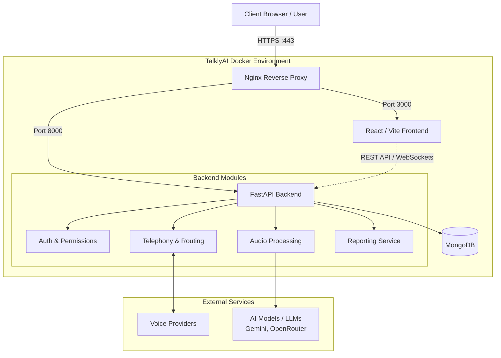

# TalklyAI - Detailed Architecture

## High-Level Architecture Diagram

## System Components

### 1. Nginx (Reverse Proxy & Gateway)
- **Role:** Handles all incoming HTTP/HTTPS traffic, performs SSL termination via Let's Encrypt, and manages routing.
- **Routing:** 
  - Routes web UI traffic to the React Frontend (`:3000`).
  - Routes API requests to the Python FastAPI Backend (`:8000`).

### 2. Frontend (React 18 + Vite)
- **Tech Stack:** React, TypeScript, TailwindCSS, Framer Motion, Lucide React.
- **Responsibility:** Delivers the interactive user interface, dashboards for lead intelligence, agent benchmarking, and live conversation monitoring.
- **Communication:** Connects to the backend via standard REST APIs (configured via `NEXT_PUBLIC_API_URL`).

### 3. Backend (Python + FastAPI)
- **Core Server:** High-performance asynchronous API server using `uvicorn`.
- **Modules & Services:**
  - **Audio Processing (`process_audio.py`):** Transcribes audio and extracts entities and buyer intents.
  - **Telephony (`telephony/`):** Handles inbound calling, webhook processing, and interaction with telecom providers.
  - **Reports (`report_service.py`):** Aggregates data for live agent performance tracking and automated feedback.
  - **Authentication (`auth.py`):** Handles secure access for admins and users.
- **AI Integrations:** Calls out to LLMs (Gemini, OpenRouter) to process conversation transcripts.

### 4. Database (MongoDB)
- **Adapter:** Connected asynchronously using `motor_asyncio`.
- **Collections:** Stores `calls` (transcripts, scores, intent markers) and `language_mappings`.
- **Performance:** Relies on indexed fields (`call_id`, `created_at`, `direction`, `status`, `intent`) for rapid dashboard querying, along with TTL indexes for data retention (weekly auto-delete).

### 5. Containerization (Docker Compose)
- **Orchestration:** Managed via `docker-compose.yml` for seamless deployments.
- **Services:** Runs `frontend`, `backend`, and `nginx` as isolated containers.
- **Resilience:** Uses `restart: unless-stopped` to ensure high availability on the server.
